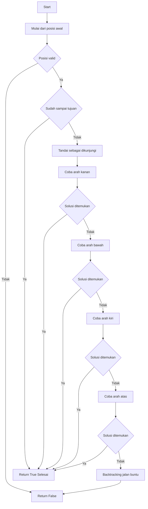

# 🐭 Rat in a Maze - Backtracking Visualization

## 📌 Deskripsi

Project ini merupakan implementasi algoritma **Backtracking** untuk menyelesaikan permasalahan *Rat in a Maze* menggunakan bahasa **Python** dengan visualisasi berbasis GUI (*Graphical User Interface*) menggunakan **Tkinter**.

Program ini mensimulasikan seekor tikus yang mencari jalan keluar dari sebuah labirin untuk mencapai keju sebagai tujuan akhir. Setiap langkah divisualisasikan secara real-time, termasuk proses *backtracking* ketika menemukan jalan buntu.

---

## 🎯 Tujuan

* Mengimplementasikan algoritma backtracking
* Memvisualisasikan proses pencarian solusi
* Memahami konsep rekursi dan eksplorasi solusi

---

## 🧠 Konsep Backtracking

Backtracking adalah teknik algoritma yang mencoba semua kemungkinan solusi secara bertahap. Jika suatu langkah tidak memenuhi kondisi, maka algoritma akan **kembali (backtrack)** ke langkah sebelumnya dan mencoba alternatif lain.

Pada kasus ini:

* Tikus mencoba bergerak ke 4 arah: kanan, bawah, kiri, atas
* Jika menemui jalan buntu, maka kembali ke posisi sebelumnya
* Proses berhenti ketika mencapai tujuan

---

## 🖥️ Fitur Program

* 🎨 Visualisasi GUI interaktif
* 🐭 Animasi pergerakan tikus
* 🟢 Warna hijau: jalur yang benar
* 🔴 Warna merah: jalan buntu (backtracking)
* 🔵 Tujuan (keju)
* 🔄 Tombol reset
* 🚀 Tombol start

---

## ⚙️ Cara Menjalankan Program

1. Pastikan Python sudah terinstall
2. Jalankan file Python:

```bash
Tugas Alpro.py
```

3. Klik tombol **START ADVENTURE**
4. Amati bagaimana algoritma bekerja

---

## 🧩 Pseudocode

```
function SOLVE(x, y):
    jika posisi tidak valid atau tembok:
        return False

    jika posisi adalah tujuan:
        return True

    tandai sebagai dikunjungi

    untuk setiap arah (kanan, bawah, kiri, atas):
        jika SOLVE(next):
            return True

    tandai sebagai jalan buntu (backtrack)
    return False
```

---

## 🔁 Flowchart


---

## 🔄 Cara Kerja Program

1. Program dimulai dari titik awal (0,0)
2. Tikus mencoba bergerak ke arah yang memungkinkan
3. Jika jalan valid → lanjut
4. Jika buntu → kembali (backtracking)
5. Proses berulang sampai tujuan ditemukan

---


## 📌 Kesimpulan

Algoritma backtracking efektif digunakan untuk menyelesaikan masalah pencarian solusi seperti *Rat in a Maze*. Dengan visualisasi GUI, proses algoritma menjadi lebih mudah dipahami karena setiap langkah dapat dilihat secara langsung.

---

## ✨ Author

Nama: Andri Pratama
Kelas: B
NIM: 21120124140134
